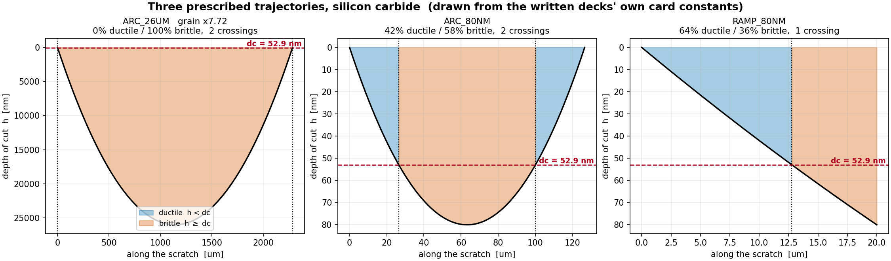

# RUN_TRAJECTORY - three prescribed-trajectory jobs, silicon carbide

All three cut **Silicon carbide, SiC-N (supplied as 'monocrystalline silicon')**.
Critical depth of cut **dc = 52.920 nm** (Bifano, form 2).

| | job | trajectory | peak | ductile | crossings | elements | 8-core |
|---|---|---|---|---|---|---|---|
| 1 | `ARC_26UM` | arc | 26.0000 um | 0 % | 2 | 219,450 | 5.7 h |
| 2 | `ARC_80NM` | arc | 0.0800 um | 42 % | 2 | 171,836 | 73.8 h |
| 3 | `RAMP_80NM` | ramp | 0.0800 um | 64 % | 1 | 27,132 | 2.3 h |



## What each one is for

**1 - `ARC_26UM`.** The drawn trajectory: depth 0 at entry, 26 um at mid-span,
back to 0 at exit. 26 um is about 490 x dc, so removal is brittle essentially
everywhere and **no transition is expected**. This job exists to show that the
grit follows the curve in the figure, not to show a transition.

**2 - `ARC_80NM`.** The same arc scaled to an 80 nm peak. 80 nm against dc =
52.92 nm is 1.51 x, so the cut starts ductile, crosses into brittle, and
crosses back: **ductile - brittle - ductile, two transitions at u = +-36.8 um**,
symmetric about the centre. This is the picture the model exists to produce.

**3 - `RAMP_80NM`.** A straight 0 -> 80 nm ramp, as the control. One crossing
at 63.8 %% along, and because depth is linear in position the transition station
can be read off the plot and checked against dc by hand.

## Why the block is not 17 mm long

The figure's axes are 17 mm across by 26 um deep, a vertical exaggeration of
about 650:1. Taken literally, a 17 mm chord with 26 um of sagitta needs a tip
radius of 1389 mm - a 2.8 m wheel. The wheel here is 50 mm diameter, and over
17 mm of arc a 25 mm radius would cut 1445 um deep, 56 x the figure.

So the **shape** is reproduced exactly and the **length** follows from the real
wheel: for a sagitta D on radius R the chord is L = sqrt(8 R D). That gives
2.28 mm at 26 um and 126.5 um at 80 nm. Both are honest arcs of the actual
wheel; neither invents a radius. The figure's 0..17 is a normalised axis.

## The grain is scaled for job 1, and only job 1

A grit cuts only as deep as it stands proud of the bond. The measured B4C
grains are about 7 um tall, so a 26 um cut from one is not a meshing problem -
it is impossible, and `verify_rigid_deck` refuses it: the bond rim would be
driven 22 um into the workpiece.

Job 1 therefore scales the library by **x7.716**. Every length scales together,
so the grain keeps its measured shape exactly - same aspect ratio, same corner
angles, same concave cutting features - and only its size changes. Jobs 2 and 3
cut 80 nm, which any measured grain clears by two orders of magnitude, so they
use the grains **exactly as measured**.

## How the trajectory is imposed

`vumat_grind.for` reads `h(u) = H0 + HG*u - u^2/(2*RTIP)` from the material
card - already a line plus a parabola. So:

* an **arc** is `HG = 0`: no infeed, and the parabola alone carries h from 0 up
  to the peak and back down. The depth is the wheel's own curvature.
* a **ramp** is the linear term, with `H0` and `HG` solved so h is 0 at the
  entry and the peak at the exit **with the parabola present** rather than
  pretending it is not.

These two constants are **prescribed**, not derived from the seating and the
infeed, because here the trajectory is the specification rather than the
consequence. Every deck says so in its own header, so a reader can tell an
imposed number from a derived one.

## Running them

```
cd ARC_26UM && abaqus job=arc_26um input=arc_26um.inp user=vumat_grind.for double=both cpus=8 interactive
cd ARC_80NM && abaqus job=arc_80nm input=arc_80nm.inp user=vumat_grind.for double=both cpus=8 interactive
cd RAMP_80NM && abaqus job=ramp_80nm input=ramp_80nm.inp user=vumat_grind.for double=both cpus=8 interactive
```

`double=both` is required: h is compared against a 53 nm threshold on a 25 mm
radius, a ratio of 2e-6, and single precision does not have the digits.

## What to plot

**SDV13** is the branch - 1 ductile, 2 brittle. On job 2 it should show a blue
band, an orange band, and a blue band along the groove, switching at u = +-36.8
um. That single picture is the result.

SDV14 is the h each point was given, SDV15 is dc, SDV19 the strain-gradient
amplification. `RF`/`RM` at `A_WHEEL_REF` are the grinding force.

## Verification

Every deck passes, on the file that was written:

* `verify_rigid_deck.py` - 0 failures
* `verify_rigid_deck2.py` - 0 failures
* `verify_hybrid_deck.py` - **all 34 checks**, including the compiled VUMAT
  picking the same branch the card predicts

The node counts the hybrid gate reads off the written mesh agree with the
design to the third digit: 42.0 % ductile on job 2 against 41.9 % predicted.

## Before quoting a force

The Johnson-Cook constants for silicon carbide are **placeholders** except `A`,
which is derived from the JH-2 card's own quasi-static compressive strength so
the two branches meet at the transition. `B, n, C, m` and `D1..D5` are
order-of-magnitude values. The **branch map (SDV13) is the result**; the force
magnitudes are not, until those constants are calibrated.
